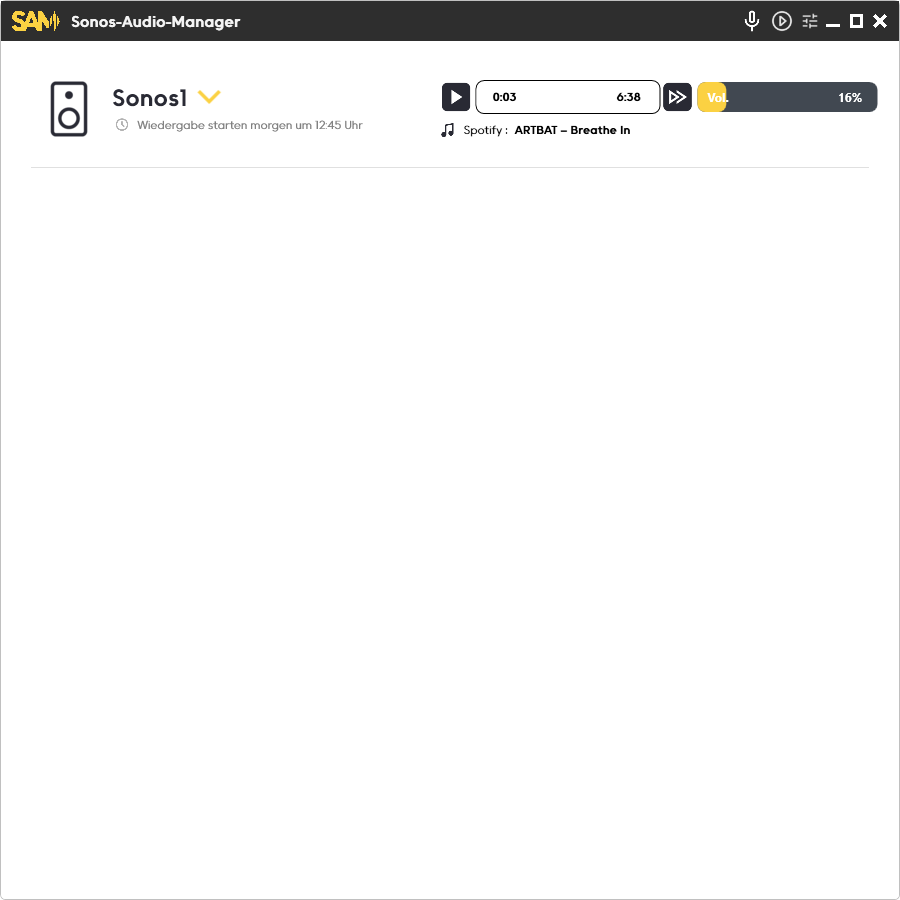
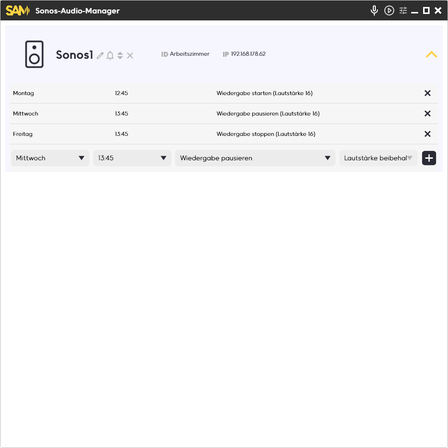
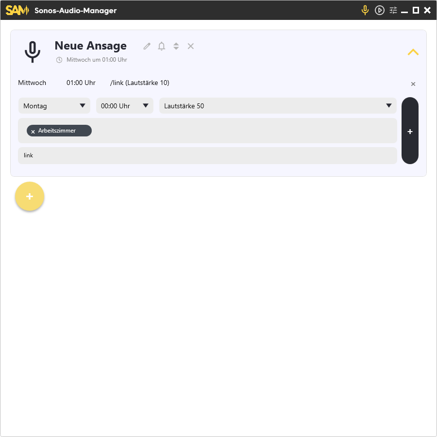
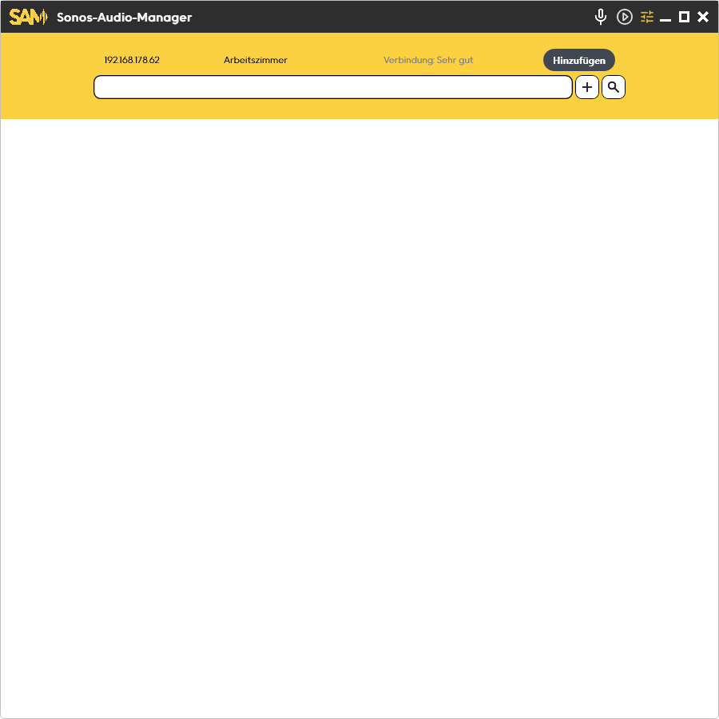

# Sonos Audio Manager

Willkommen beim **Sonos Audio Manager**!

Eine leistungsfähige, eigenständige Desktop-App zum Steuern, Gruppieren und Automatisieren von Sonos-Lautsprechern – mit moderner Oberfläche, Zeitplänen und Spotify-Integration.

---

## 🟡 **Features**

- **Intuitive Steuerung** deiner Sonos-Lautsprecher (Wiedergabe, Pause, Lautstärke…)
- **Planen & Automatisieren:**  
  Zeitpläne für Aktionen auf beliebigen Lautsprechern
- **Lautsprecher-Gruppen:**  
  Räume auswählen, kombinieren, flexibel steuern
- **Spotify-Integration**  
  Titelanzeige, Status, direkte Kontrolle
- **Modernes UI**  
  Sauberes, anpassbares WPF-Frontend  
- **Python-Sonos-Bridge**  
  Schnelle Kommunikation per lokaler API

---

## 🖼️ **Screenshots**

### Übersicht

---

### Übersicht (mit Lautsprecher)

---

### Übersicht (zweites Layout)

---

### Zeitpläne und Lautsprecher-Auswahl

---

### Ansagen erstellen

---

### Suche / Lautsprecher hinzufügen

---

## 🔒 **Hinweis zum Code**

Der **Sourcecode bleibt privat**.  
Dieses Repo dient ausschließlich als Portfolio/Demo für Bewerbungen, Referenzen, etc.

---

## 👨‍💻 **Tech Stack**

- **Frontend:** .NET (WPF, C#)
- **Backend:** Python Sonos-API Bridge (lokal)
- **Design:** Modern, responsive, dark/light

---

## 📬 Kontakt

Bei Interesse, Feedback oder für eine Demo:  
**[Deine E-Mail oder LinkedIn/Website hier eintragen]**

---

© 2024 [Dein Name]
