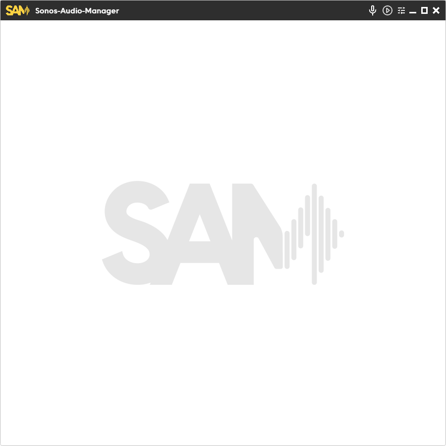

<!-- Logo oben, klein -->

  

# Sonos Audio Manager

**Sonos Audio Manager (SAM)** ist eine moderne Desktop-App zur Verwaltung von Sonos-Lautsprechern.  
Sie bietet übersichtliche Steuerung, Planung und viele Features rund um Multiroom-Audio – alles im minimalistischen Look.

---

## Features

- **Lautsprecher-Übersicht**: Sieh alle Sonos-Geräte, ihre Gruppen und Status auf einen Blick.
- **Zeitgesteuerte Aktionen**: Lege beliebige Aktionen (Play, Pause, Stop, Lautstärke, Streams) mit flexiblen Zeitplänen fest.
- **Ansagen & Testtöne**: Sende Sounds oder Ansagen an einen oder mehrere Speaker.
- **Gruppenverwaltung**: Koordiniere Räume, steuere mehrere Lautsprecher gemeinsam.
- **Spotify-Integration**: Anzeige von Trackinfos für laufende Wiedergabe.
- **Schönes UI**: Klar, responsiv, helles Theme.

---

## Screenshots

  
   
  
   
  
  

---

## Branding

  

---

## Technisches

- **Sprache:** Python (Backend), C# (Frontend, Backend)
- **API:** Nutzt die [SoCo](https://github.com/SoCo/SoCo)-Bibliothek zur Sonos-Steuerung.
- **Keine Cloud:** Läuft komplett lokal, kein externer Dienst.
- **Kein Download:** Dies ist eine reine Portfoliopräsentation.

---

## Hinweis

Der Quellcode ist **nicht öffentlich** verfügbar.  
Diese Seite dient nur zur Präsentation des Projekts.

---

**Screenshots und Logo © Rettek / Sonos Audio Manager**

